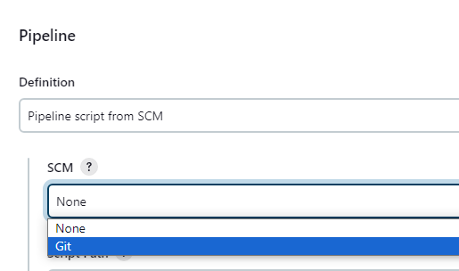
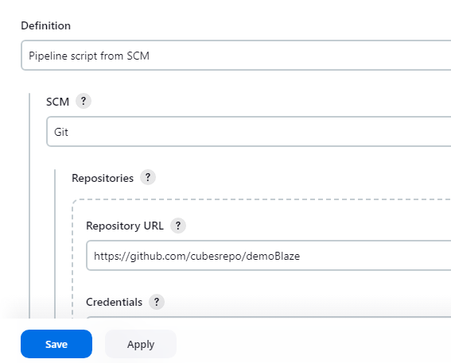
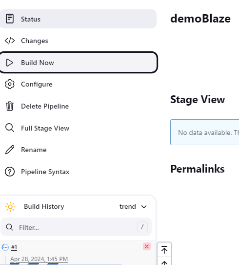

**Hello**🖐 **Automated Testing for demoBlaze Demo Website with (Selenium, Pytest, Page Object Model(POM), Allure Reports, Jenkins Pipeline)**

This project automates key user flows in the DemoBlaze shopping site, covering important actions like account creation, logging in, adding items to the cart, and placing an order.

Aside from the standard flow, I also checked several edge cases to see how the system reacts to unusual or incomplete user actions.
These include:
   - Signing up without entering a username or password 
   - Attempting to register an account that already exists 
   - Logging in without providing email or password 
   - Logging in with an incorrect password 
   - Deleting items from the cart before completing an order 
   - Attempting to place an order with missing customer details
___________________________________________

🎯🎯 **Pre-requisites:**
- Python 3.11.9
- Any browsers(Chrome, Firefox, Edge)
___________________________________________

▶ **Test Execution**

Run commands: 
1. Install Dependecies:

       pip install -r requirements.txt
2. Run the test with Allure report:

       pytest -v --alluredir=reports/TestCase1
   or specifying browser

       pytest -v --browser=edge --alluredir=reports/TestCase1
    

**To run this on jenkins**
1. Add item name, click Pipeline and click OK
    
    
2. Scroll down and navigate to Pipeline then select "pipeline script from SCM"
    
   
3. Select Git
    
   
4. Paste the Repo URL and click Apply and Save
    
   
5. Click build now
    
   
   

    
   
   
    

    
   
   
    
